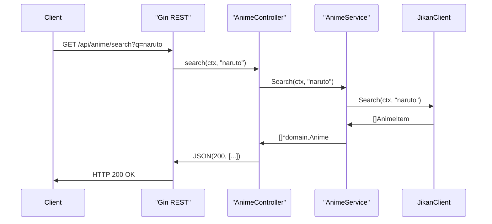

# Microservices Planner Documentation

This document provides a detailed overview of the three Go microservices—**anime-search**, **auth**, and **users**—and their supporting files. Each section describes the purpose of each file, how they fit together, and their interdependencies. Where it aids clarity, simple Mermaid diagrams illustrate key flows.

---

## Index

1. [anime-search Service](#anime-search-service)  
2. [auth Service](#auth-service)  
3. [users Service](#users-service)  
4. [Deployment](#deployment)  

---

## 1. anime-search Service

### 1.1 Overview

The **anime-search** service exposes both a REST API (via Gin) and a gRPC interface to search for anime metadata using the Jikan API (https://api.jikan.moe). It is composed of:

- **cmd/**: application entrypoint
- **app/**: HTTP & gRPC server initialization + routing
- **internal/config**: environment-based configuration
- **internal/anime**: domain, client, service, controller, transport logic
- **Docker & Make**: containerization and tooling

### 1.2 High-Level Flow



### 1.3 Files & Relationships

| File                                       | Role                                                                                              |
|--------------------------------------------|---------------------------------------------------------------------------------------------------|
| **cmd/main.go**                            | Bootstraps the FX app: loads config, app, and anime modules.                                      |
| **app/module.go**                          | Aggregates Fx providers: `NewServer` and routes injector.                                         |
| **app/server.go**                          | Defines `Server`: starts both Gin HTTP and gRPC servers on lifecycle hooks.                       |
| **app/routers.go**                         | Invokes route registration: groups `/api` and delegates to `AnimeController`.                     |
| **internal/config/config.go**              | Loads `.env`, exposes `Config{HTTPPort, GRPCPort, …}`.                                            |
| **internal/config/module.go**              | Provides `LoadConfig` to the Fx container.                                                        |
| **internal/anime/domain/anime.go**         | Defines `Anime` struct & `AnimeService` interface.                                                |
| **internal/anime/client/jikan.go**         | Low-level HTTP client for Jikan API: `Search` and `GetByID`.                                       |
| **internal/anime/service/anime.go**        | Implements `AnimeService` by adapting Jikan data into domain models.                              |
| **internal/anime/controller/anime.go**     | Gin handlers: `/anime/search`, `/anime/:id`, `/anime`.                                            |
| **internal/anime/transport/grpc.go**       | gRPC server implementation of the `AnimeService` interface.                                       |
| **internal/anime/module.go**               | Binds `JikanClient`, `NewAnimeService`, `AnimeController`, and gRPC transport into FX.           |
| **.dockerignore**, **Dockerfile**, **Makefile** | Container build rules and helper targets.                                                   |
| **go.mod**, **go.sum**                     | Module dependencies, including Jikan proto import.                                                |

---

## 2. auth Service

### 2.1 Overview

The **auth** service handles user registration, login, and JWT verification. It communicates with the **users** service via gRPC to persist and retrieve user records.

### 2.2 Files & Relationships

| File                                         | Role                                                                                         |
|----------------------------------------------|----------------------------------------------------------------------------------------------|
| **cmd/main.go**                              | Starts Fx with config, app, auth modules and injects a `UserServiceClient`.                  |
| **app/module.go**                            | Provides `NewServer` and route registration.                                                |
| **app/server.go**                            | Spins up Gin REST and gRPC servers; registers `AuthServiceServer`.                           |
| **app/routers.go**                           | Mounts `/api/auth` routes via `AuthController`.                                             |
| **internal/config/config.go**                | Loads JWT secret and service addresses.                                                     |
| **internal/config/module.go**                | Fx provider for configuration.                                                              |
| **internal/auth/domain/auth.go**             | Request/response DTOs and `AuthService` interface.                                          |
| **internal/auth/client/user.client.go**      | Creates a gRPC client to **users** service; injects into Fx.                                |
| **internal/auth/service/auth.service.go**    | Implements registration/login/verify workflows; hashes passwords & issues JWTs.             |
| **internal/auth/controller/auth.go**         | Gin handlers: `/register`, `/login`, `/verify`.                                             |
| **internal/auth/transport/grpc.go**          | gRPC layer exposing the same `AuthService` interface methods.                               |
| **internal/auth/module.go**                  | Binds controller, service, transport into Fx.                                               |
| **pkg/hashPassword.go**                      | Bcrypt wrapper.                                                                             |
| **pkg/checkPasswordHash.go**                 | Verifies bcrypt password.                                                                   |
| **pkg/generateJwtToken.go**                  | Creates HS256 JWT with expiry from config.                                                  |
| **.dockerignore**, **Dockerfile**, **Makefile** | Container build & dependency tooling.                                                   |
| **go.mod**, **go.sum**                       | Module dependencies (Gin, JWT, gRPC, Fx, etc.).                                             |

---

##  3. users Service

### 3.1 Overview

The **users** service manages the PostgreSQL–backed user database, exposing HTTP endpoints for CRUD and a gRPC API for other services (notably **auth**).

### 3.2 Files & Relationships

| File                                          | Role                                                                                             |
|-----------------------------------------------|--------------------------------------------------------------------------------------------------|
| **cmd/main.go**                               | Orchestrates Fx: config, database, app, user modules; runs DB migration.                          |
| **app/module.go**                             | Provides `NewServer` and Gin→controller route wiring.                                            |
| **app/server.go**                             | Starts Gin REST on `HTTP_PORT`, gRPC on `GRPC_PORT`.                                             |
| **app/routers.go**                            | Mounts `/api/users` via `UserController`.                                                        |
| **internal/config/config.go**                 | Loads DB connection string & ports.                                                              |
| **internal/config/module.go**                 | Fx provider for config.                                                                          |
| **internal/database/database.go**             | Opens GORM DB connection.                                                                        |
| **internal/database/migrate.go**              | Auto-migrates `domain.User` schema.                                                              |
| **internal/database/module.go**               | Provides database to Fx.                                                                         |
| **internal/user/domain/user.go**              | `User` GORM model & repository/service interfaces.                                               |
| **internal/user/repository/user.repository.go** | Implements CRUD & lookup operations via GORM.                                                  |
| **internal/user/service/user.service.go**     | Business logic layer, delegates to repository.                                                   |
| **internal/user/controller/user.go**          | Gin handlers for GET/POST/PUT/DELETE under `/users`.                                             |
| **internal/user/helpers/maptoproto.go**       | Converts domain `User` → gRPC `userpb.User`.                                                     |
| **internal/user/transport/grpc.go**           | gRPC server exposing `UserService`.                                                              |
| **internal/user/module.go**                   | Binds repository, service, controller, transport into Fx.                                        |
| **.dockerignore**, **Dockerfile**, **Makefile**  | Build & containerization scripts.                                                             |
| **docker-compose.yml**                        | Local orchestration of DB & service containers.                                                  |
| **go.mod**, **go.sum**                        | Dependencies (GORM, Gin, Fx, gRPC, etc.).                                                        |

---

## 4. Deployment

### docker-compose.prod.yml

Defines the production composition:

- **users-db**: PostgreSQL 16 with healthchecks & volume mount.
- **users**: users service (port 8081).
- **auth**: auth service (port 8082).
- **anime-search**: anime-search service (port 8080).  
All services join the `app` network and pull the latest images from GHCR.

```yaml
services:
  users-db:
    image: postgres:16-alpine
    restart: unless-stopped
    env_file: ./env/users-db.env
    volumes:
      - ./data/users-db:/var/lib/postgresql/data
    networks: [app]
    healthcheck:
      test: ["CMD-SHELL", "pg_isready -U $${POSTGRES_USER} -d $${POSTGRES_DB}"]
      interval: 10s
      timeout: 5s
      retries: 6
    ports: ["15432:5432"]

  users:
    image: ghcr.io/${OWNER}/users:latest
    restart: unless-stopped
    env_file: ./env/users.env
    ports: ["8081:8081"]
    networks: [app]

  auth:
    image: ghcr.io/${OWNER}/auth:latest
    restart: unless-stopped
    env_file: ./env/auth.env
    ports: ["8082:8081"]
    networks: [app]

  anime-search:
    image: ghcr.io/${OWNER}/anime-search:latest
    restart: unless-stopped
    env_file: ./env/anime-search.env
    ports: ["8080:8080"]
    networks: [app]

networks:
  app:
    name: microservices-planner_net
```

---

**Summary of Relationships**

- **Dependency Injection (Fx)** wires together configuration, transport, controllers, and services in each microservice.
- **gRPC Contracts** (from `github.com/merdernoty/anime-proto`) define shared messages and service interfaces for inter-service communication.
- The **auth** service uses a gRPC client to **users** (via `internal/auth/client/user.client.go`).
- The **anime-search** service is self-contained, calling the external Jikan HTTP API.
- All three services expose both HTTP (for external consumers) and gRPC (for inter-service calls).

This modular structure promotes clear separation of concerns:

- **config/**: environment & configuration
- **client/**: external HTTP or gRPC clients
- **service/**: business logic
- **controller/**: HTTP routing & handlers
- **transport/**: gRPC server adapters
- **module.go**: Fx DI binding

---